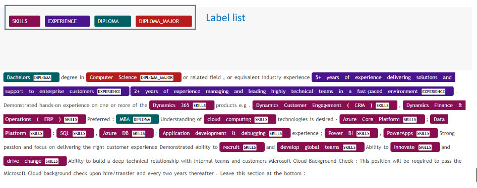

# Django / Angular
<h1>An Candidate test</h1>

<h5>Problem statement:</h5>
The goal is to create a user interface with BE/FE made with Django/Angular to label words in a document and export the position of the annotated words in a JSON file format. As an example in fig 1, a document was annotated with labels: SKILLS, EXPERIENCE, DIPLOMA and DIPLOMA_MAJOR. The application should have the following functions:
User inputs a labels list
Selects a label from the list
Selects a word or a sentence from the document and annotate with the desired label
Export the annotation to a JSON format with labels positions and labels titles (see fig 2). The JSON file should follow this format:
{“document”:<text>, “annotation”:[{start: <start position>, “end”: <start position>, “label”: <label>, “text”:<Annotated Text>
Optional: Dockerize the application with docker compose.
Note: Use Angular for UI design and Django for backend.
 
<h6>Fig1: Annotation User Interface</h6>

<h6>Fig2: Exported JSON file</h6>

